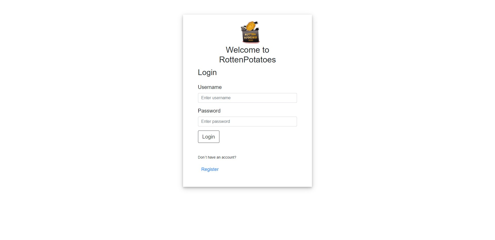
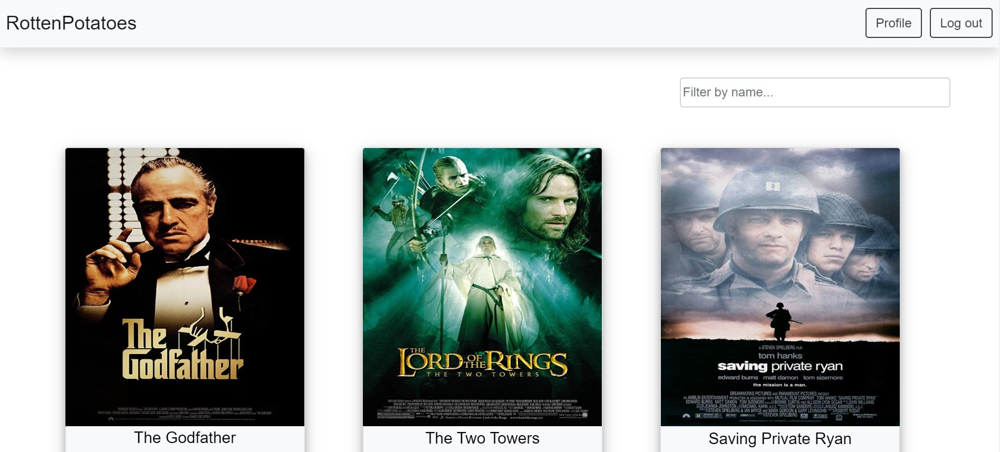

# rotten-potatoes

#### Active project running on Heroku: [rotten-potatoes3000](http://rotten-potatoes3000.herokuapp.com/client/)

### Summary
 * Using React, build the client-side for an application called rotten-potatoes based on server-side code (REST API and database).
 * Stack: MongoDB, ExpressJS, ReactJS, NodeJS(MERN App).

### Project Description
 * RottenPotatoes provides users with access to information related to different movies, directors, movie genres and actors. 
 * Users will be able to register, update their information and create a list of their favourite movies.

### Installation instructions
 * Once you cloned the repository, navigate to the root directry and run __npm install__
 * Next, run __npm run start__
 * Open your browser of choice and nagivate to the _localhost_ specified in your terminal
 * To login, use the following credentials to login:
    * Username: test1
    * Password testpassword1

### Dependencies
 * uuid
 * cors
 * react
 * axios
 * bcrypt
 * morgan
 * lodash
 * express
 * passport
 * mongoose
 * react-dom
 * prop-types
 * body-parser
 * jsonwebtoken
 * passport-jwt
 * passport-local
 * react-bootstrap
 * react-router-dom
 * express-validator

### Features
 * Return a list of all available movies to the user.
 * Return data (description, genre, director, image URL, whether it’s featured or not) about a single movie by title to the user.
 * Return data about a genre by name.
 * Return data about a director (including bio, birth year) by name.
 * Allow new users to register.
 * Allow users to update their user info (username, password, email, date of birth).
 * Allow users to add and remove a movie to their list of favorites.
 * Allow existing users to deregister.

### Requirements
 * The application must be a single-page application (SPA)
 * The API must be a [Node.js](https://nodejs.org/en/) and [Express](http://expressjs.com/) application
 * The API must use REST architecture, with URL endpoints corresponding to the data operations listed in Features(see above section)
 * The API must use at least three middleware modules, such as the [body-parser](https://www.npmjs.com/package/body-parser) package for reading data from requests and [morgan](https://www.npmjs.com/package/morgan) for logging
 * The API must use a “package.json” file
 * The database must be built using [MongoDB](https://www.mongodb.com/)
 * The business logic must be modeled with [Mongoose](https://mongoosejs.com/)
 * The API must provide movie information in [JSON](https://www.json.org/json-en.html) format

### Images

